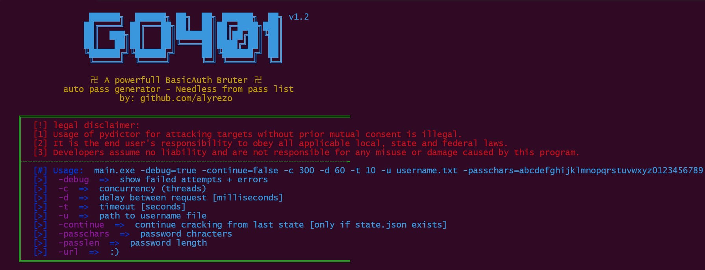

<h1 align="center">
  GO 401
  <br>
</h1>

<p align="center">
  <a href="#features">Features</a> •
  <a href="#download">Download</a> •
  <a href="#usage">Usage</a> •
  <a href="#disclaimer">Disclaimer</a> •
  <a href="#license">License</a>
</p>

---
<p align="center">
    THIS IS OLD PROJECT THAT NOW IS AVAILABLE
</p>
GO401 is a web auth brute force tool that discovers username and password of basic auth No need for a list password

# Features

<h1 align="left">
  </a>
  <br>
</h1>

- Fast and powerful
- Find username and password
- Password list needless
- No need to install anything
- Colorful

# Download

You can download the pre-build version from [Releases](https://github.com/alyrezo/Go401/releases) and run it with the terminal or build it by yourself

# Usage

```sh
main.exe -debug=true -continue=false -c 300 -d 60 -t 10 -u username.txt -passchars=abcdefghijklmnopqrstuvwxyz0123456789 -passlen=8 -url http://127.0.0.1:9903/form
```
```yaml
-debug  =>  show failed attempts + errors
-c  =>  concurrency (threads)
-d  =>  delay between request [milliseconds]
-t  =>  timeout [seconds]
-u  =>  path to username file
-continue  =>  continue cracking from last state [only if state.json exists]
-passchars  =>  password chracters
-passlen  =>  password length
-url  =>  :)
```

# Disclaimer

- Usage of pydictor for attacking targets without prior mutual consent is illegal.
- It is the end user's responsibility to obey all applicable local, state and federal laws.
- Developers assume no liability and are not responsible for any misuse or damage caused by this program.

# License
`Go 401` is made with 💚 by the [alyrezo](https://Twitter.com/alyrezo)
